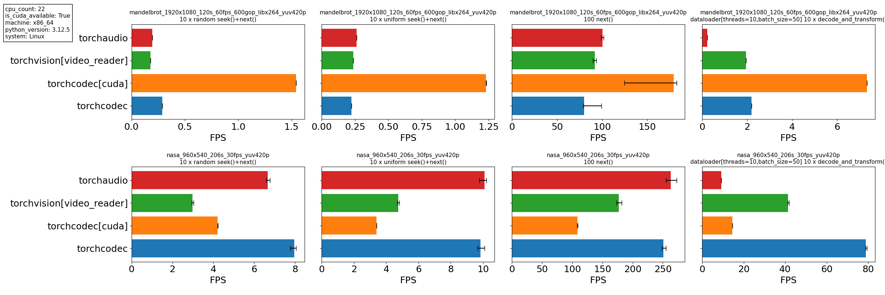

[**Installation**](#installing-torchcodec) | [**Simple Example**](#using-torchcodec) | [**Detailed Example**](https://pytorch.org/torchcodec/stable/generated_examples/) | [**Documentation**](https://pytorch.org/torchcodec) | [**Contributing**](CONTRIBUTING.md) | [**License**](#license)

# TorchCodec


TorchCodec is a Python library for decoding videos into PyTorch tensors. It aims
to be fast, easy to use, and well integrated into the PyTorch ecosystem. If you
want to use PyTorch to train ML models on videos, TorchCodec is how you turn
those videos into data.

We achieve these capabilities through:

* Pythonic APIs that mirror Python and PyTorch conventions.
* Relying on [FFmpeg](https://www.ffmpeg.org/) to do the decoding. TorchCodec
  uses the version of FFmpeg you already have installed. FFmpeg is a mature
  library with broad coverage available on most systems. It is, however, not
  easy to use. TorchCodec abstracts FFmpeg's complexity to ensure it is used
  correctly and efficiently.
* Returning data as PyTorch tensors, ready to be fed into PyTorch transforms
  or used directly to train models.

> [!NOTE]
> ⚠️ TorchCodec is still in early development stage and some APIs may be updated
> in future versions without a deprecation cycle, depending on user feedback.
> If you have any suggestions or issues, please let us know by
> [opening an issue](https://github.com/pytorch/torchcodec/issues/new/choose)!

## Using TorchCodec

Here's a condensed summary of what you can do with TorchCodec. For a more
detailed example, [check out our
documentation](https://pytorch.org/torchcodec/stable/generated_examples/)!

```python
from torchcodec.decoders import VideoDecoder

decoder = VideoDecoder("path/to/video.mp4")

decoder.metadata
# VideoStreamMetadata:
#   num_frames: 250
#   duration_seconds: 10.0
#   bit_rate: 31315.0
#   codec: h264
#   average_fps: 25.0
#   ... (truncated output)

len(decoder)  # == decoder.metadata.num_frames!
# 250
decoder.metadata.average_fps  # Note: instantaneous fps can be higher or lower
# 25.0

# Simple Indexing API
decoder[0]  # uint8 tensor of shape [C, H, W]
decoder[0 : -1 : 20]  # uint8 stacked tensor of shape [N, C, H, W]


# Iterate over frames:
for frame in decoder:
    pass

# Indexing, with PTS and duration info
decoder.get_frame_at(len(decoder) - 1)
# Frame:
#   data (shape): torch.Size([3, 400, 640])
#   pts_seconds: 9.960000038146973
#   duration_seconds: 0.03999999910593033

decoder.get_frames_in_range(start=10, stop=30, step=5)
# FrameBatch:
#   data (shape): torch.Size([4, 3, 400, 640])
#   pts_seconds: tensor([0.4000, 0.6000, 0.8000, 1.0000])
#   duration_seconds: tensor([0.0400, 0.0400, 0.0400, 0.0400])

# Time-based indexing with PTS and duration info
decoder.get_frame_played_at(pts_seconds=2)
# Frame:
#   data (shape): torch.Size([3, 400, 640])
#   pts_seconds: 2.0
#   duration_seconds: 0.03999999910593033
```

You can use the following snippet to generate a video with FFmpeg and tryout
TorchCodec:

```bash
fontfile=/usr/share/fonts/dejavu-sans-mono-fonts/DejaVuSansMono-Bold.ttf
output_video_file=/tmp/output_video.mp4

ffmpeg -f lavfi -i \
    color=size=640x400:duration=10:rate=25:color=blue \
    -vf "drawtext=fontfile=${fontfile}:fontsize=30:fontcolor=white:x=(w-text_w)/2:y=(h-text_h)/2:text='Frame %{frame_num}'" \
    ${output_video_file}
```

## Installing TorchCodec

Note: if you're on MacOS, you'll need to [build from source](./CONTRIBUTING.md).
The instructions below assume you're on Linux.

  1. Install the latest stable version of PyTorch following the
     [official instructions](https://pytorch.org/get-started/locally/). TorchCodec
     requires [PyTorch 2.4](https://pytorch.org/docs/2.4/).

  2. Install FFmpeg, if it's not already installed. Your Linux distribution probably
     comes with FFmpeg pre-installed. TorchCodec supports all major FFmpeg versions
     in [4, 7].

     If FFmpeg is not already installed, or you need a later version, install it with:

     ```bash
     conda install ffmpeg
     # or
     conda install ffmpeg -c conda-forge
     ```
  3. Install TorchCodec:

     ```bash
     pip install torchcodec
     ```

## Benchmark Results

The following was generated by running [our benchmark script](./benchmarks/decoders/generate_readme_chart.py) on a lightly loaded 22-core machine.



## Planned future work

We are actively working on the following features:

- [Ship wheels for MacOS](https://github.com/pytorch/torchcodec/issues/111), so
  that MacOS users can `pip install torchcodec`. For now this is only supported
  on Linux, but MacOS users can [build from source](./CONTRIBUTING.md).
- [GPU decoding](https://github.com/pytorch/torchcodec/pull/58)
- [Audio decoding](https://github.com/pytorch/torchcodec/issues/85)

Let us know if you have any feature requests by [opening an
issue](https://github.com/pytorch/torchcodec/issues/new?assignees=&labels=&projects=&template=feature-request.yml)!

## Contributing

We welcome contributions to TorchCodec! Please see our [contributing
guide](CONTRIBUTING.md) for more details.

## License

TorchCodec is released under the [BSD 3 license](./LICENSE).
