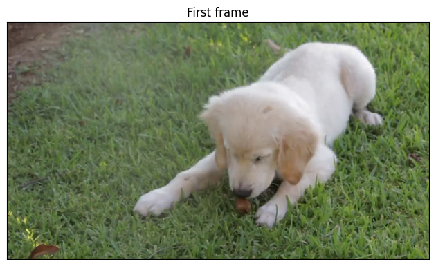
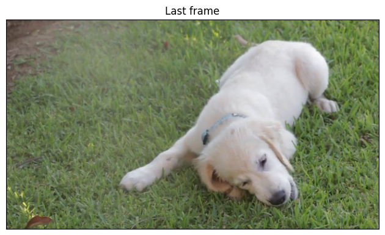
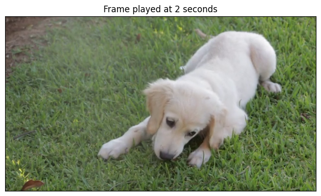

# Decoding a video with VideoDecoder

In this example, we'll learn how to decode a video using the
[`VideoDecoder`](../../generated/torchcodec.decoders.VideoDecoder.html#torchcodec.decoders.VideoDecoder) class.

First, a bit of boilerplate: we'll download a video from the web, and define a
plotting utility. You can ignore that part and jump right below to
Creating a decoder.

```
import torch
import requests

# Video source: https://www.pexels.com/video/dog-eating-854132/
# License: CC0. Author: Coverr.
url = "https://videos.pexels.com/video-files/854132/854132-sd_640_360_25fps.mp4"
response = requests.get(url, headers={"User-Agent": ""})
if response.status_code != 200:
 raise RuntimeError(f"Failed to download video. {response.status_code = }.")

raw_video_bytes = response.content

def plot(frames: torch.Tensor, title: str | None = None):
 try:
 from torchvision.utils import make_grid
 from torchvision.transforms.v2.functional import to_pil_image
 import matplotlib.pyplot as plt
 except ImportError:
 print("Cannot plot, please run `pip install torchvision matplotlib`")
 return

 plt.rcParams["savefig.bbox"] = 'tight'
 fig, ax = plt.subplots()
 ax.imshow(to_pil_image(make_grid(frames)))
 ax.set(xticklabels=[], yticklabels=[], xticks=[], yticks=[])
 if title is not None:
 ax.set_title(title)
 plt.tight_layout()
```

## Creating a decoder

We can now create a decoder from the raw (encoded) video bytes. You can of
course use a local video file and pass the path as input, rather than download
a video.

```
from torchcodec.decoders import VideoDecoder

# You can also pass a path to a local file!
decoder = VideoDecoder(raw_video_bytes)
```

The video has not yet been decoded by the decoder, but we already have access to
some metadata via the `metadata` attribute which is a
[`VideoStreamMetadata`](../../generated/torchcodec.decoders.VideoStreamMetadata.html#torchcodec.decoders.VideoStreamMetadata) object.

```
print(decoder.metadata)
```

```
VideoStreamMetadata:
 duration_seconds_from_header: 13.8
 begin_stream_seconds_from_header: 0
 bit_rate: 505790
 codec: h264
 stream_index: 0
 width: 640
 height: 360
 num_frames_from_header: 345
 average_fps_from_header: 25
 pixel_aspect_ratio: 1
 rotation: None
 color_primaries: smpte170m
 color_space: smpte170m
 color_transfer_characteristic: smpte170m
 pixel_format: yuv420p
 begin_stream_seconds_from_content: 0
 end_stream_seconds_from_content: 13.8
 num_frames_from_content: 345
 duration_seconds: 13.8
 begin_stream_seconds: 0
 end_stream_seconds: 13.8
 num_frames: 345
 average_fps: 25
```

## Decoding frames by indexing the decoder

```
first_frame = decoder[0] # using a single int index
every_twenty_frame = decoder[0 : -1 : 20] # using slices

print(f"{first_frame.shape = }")
print(f"{first_frame.dtype = }")
print(f"{every_twenty_frame.shape = }")
print(f"{every_twenty_frame.dtype = }")
```

```
first_frame.shape = torch.Size([3, 360, 640])
first_frame.dtype = torch.uint8
every_twenty_frame.shape = torch.Size([18, 3, 360, 640])
every_twenty_frame.dtype = torch.uint8
```

Indexing the decoder returns the frames as [`torch.Tensor`](https://docs.pytorch.org/docs/stable/tensors.html#torch.Tensor) objects.
By default, the shape of the frames is `(N, C, H, W)` where N is the batch
size C the number of channels, H is the height, and W is the width of the
frames. The batch dimension N is only present when we're decoding more than
one frame. The dimension order can be changed to `N, H, W, C` using the
`dimension_order` parameter of
[`VideoDecoder`](../../generated/torchcodec.decoders.VideoDecoder.html#torchcodec.decoders.VideoDecoder). Frames are always of
`torch.uint8` dtype.

Note

If you need to decode multiple frames, we recommend using the batch
methods instead, since they are faster:
[`get_frames_at()`](../../generated/torchcodec.decoders.VideoDecoder.html#torchcodec.decoders.VideoDecoder.get_frames_at),
[`get_frames_in_range()`](../../generated/torchcodec.decoders.VideoDecoder.html#torchcodec.decoders.VideoDecoder.get_frames_in_range),
[`get_frames_played_at()`](../../generated/torchcodec.decoders.VideoDecoder.html#torchcodec.decoders.VideoDecoder.get_frames_played_at), and
[`get_frames_played_in_range()`](../../generated/torchcodec.decoders.VideoDecoder.html#torchcodec.decoders.VideoDecoder.get_frames_played_in_range). They
are described below.

```
plot(first_frame, "First frame")
```



```
plot(every_twenty_frame, "Every 20 frame")
```


## Iterating over frames

The decoder is a normal iterable object and can be iterated over like so:

```
for frame in decoder:
 assert (
 isinstance(frame, torch.Tensor)
 and frame.shape == (3, decoder.metadata.height, decoder.metadata.width)
 )
```

## Retrieving pts and duration of frames

Indexing the decoder returns pure [`torch.Tensor`](https://docs.pytorch.org/docs/stable/tensors.html#torch.Tensor) objects. Sometimes, it
can be useful to retrieve additional information about the frames, such as
their [pts](../../glossary.html#term-pts) (Presentation Time Stamp), and their duration.
This can be achieved using the
[`get_frame_at()`](../../generated/torchcodec.decoders.VideoDecoder.html#torchcodec.decoders.VideoDecoder.get_frame_at) and
[`get_frames_at()`](../../generated/torchcodec.decoders.VideoDecoder.html#torchcodec.decoders.VideoDecoder.get_frames_at) methods, which will
return a [`Frame`](../../generated/torchcodec.Frame.html#torchcodec.Frame) and [`FrameBatch`](../../generated/torchcodec.FrameBatch.html#torchcodec.FrameBatch)
objects respectively.

```
last_frame = decoder.get_frame_at(len(decoder) - 1)
print(f"{type(last_frame) = }")
print(last_frame)
```

```
type(last_frame) = <class 'torchcodec._frame.Frame'>
Frame:
 data (shape): torch.Size([3, 360, 640])
 pts_seconds: 13.76
 duration_seconds: 0.04
```

```
other_frames = decoder.get_frames_at([10, 0, 50])
print(f"{type(other_frames) = }")
print(other_frames)
```

```
type(other_frames) = <class 'torchcodec._frame.FrameBatch'>
FrameBatch:
 data (shape): torch.Size([3, 3, 360, 640])
 pts_seconds: tensor([0.4000, 0.0000, 2.0000], dtype=torch.float64)
 duration_seconds: tensor([0.0400, 0.0400, 0.0400], dtype=torch.float64)
```

```
plot(last_frame.data, "Last frame")
plot(other_frames.data, "Other frames")
```

- 
- 

Both [`Frame`](../../generated/torchcodec.Frame.html#torchcodec.Frame) and
[`FrameBatch`](../../generated/torchcodec.FrameBatch.html#torchcodec.FrameBatch) have a `data` field, which contains
the decoded tensor data. They also have the `pts_seconds` and
`duration_seconds` fields which are single ints for
[`Frame`](../../generated/torchcodec.Frame.html#torchcodec.Frame), and 1-D [`torch.Tensor`](https://docs.pytorch.org/docs/stable/tensors.html#torch.Tensor) for
[`FrameBatch`](../../generated/torchcodec.FrameBatch.html#torchcodec.FrameBatch) (one value per frame in the batch).

## Using time-based indexing

So far, we have retrieved frames based on their index. We can also retrieve
frames based on *when* they are played with
[`get_frame_played_at()`](../../generated/torchcodec.decoders.VideoDecoder.html#torchcodec.decoders.VideoDecoder.get_frame_played_at) and
[`get_frames_played_at()`](../../generated/torchcodec.decoders.VideoDecoder.html#torchcodec.decoders.VideoDecoder.get_frames_played_at), which
also returns [`Frame`](../../generated/torchcodec.Frame.html#torchcodec.Frame) and [`FrameBatch`](../../generated/torchcodec.FrameBatch.html#torchcodec.FrameBatch)
respectively.

```
frame_at_2_seconds = decoder.get_frame_played_at(seconds=2)
print(f"{type(frame_at_2_seconds) = }")
print(frame_at_2_seconds)
```

```
type(frame_at_2_seconds) = <class 'torchcodec._frame.Frame'>
Frame:
 data (shape): torch.Size([3, 360, 640])
 pts_seconds: 2.0
 duration_seconds: 0.04
```

```
other_frames = decoder.get_frames_played_at(seconds=[10.1, 0.3, 5])
print(f"{type(other_frames) = }")
print(other_frames)
```

```
type(other_frames) = <class 'torchcodec._frame.FrameBatch'>
FrameBatch:
 data (shape): torch.Size([3, 3, 360, 640])
 pts_seconds: tensor([10.0800, 0.2800, 5.0000], dtype=torch.float64)
 duration_seconds: tensor([0.0400, 0.0400, 0.0400], dtype=torch.float64)
```

```
plot(frame_at_2_seconds.data, "Frame played at 2 seconds")
plot(other_frames.data, "Other frames")
```

- 
- 

**Total running time of the script:** (0 minutes 2.067 seconds)

[`Download Jupyter notebook: basic_example.ipynb`](../../_downloads/c8852e7e664672bdb64c6ba771a9bd30/basic_example.ipynb)

[`Download Python source code: basic_example.py`](../../_downloads/d3b87ed1abb337bf60d8b0139872fe60/basic_example.py)

[`Download zipped: basic_example.zip`](../../_downloads/352107805a6429499686cf57ad2fb638/basic_example.zip)

[Gallery generated by Sphinx-Gallery](https://sphinx-gallery.github.io)